# 入职 3 个月工作汇报与转正述职

> **岗位**:后端技术专家　·　**汇报周期**:2026-04 ～ 2026-06(试用期三个月)
> **汇报对象**:各产品线 TL & 后端团队　·　**汇报性质**:试用期转正述职

| 项目 | 内容 |
|------|------|
| **姓名 / 花名** | `[姓名]` |
| **岗位** | 后端技术专家 |
| **所属团队** | `[智能体 / 摩尔业务后端]` |
| **入职日期** | `[YYYY-MM-DD]` |
| **直属上级** | `[上级姓名 / 花名]` |

---

## 目录

- [一、执行摘要(TL;DR)](#一执行摘要tldr)
- [二、关于我与角色定位](#二关于我与角色定位)
- [三、三个月工作全景](#三三个月工作全景)
- [四、成果详述](#四成果详述)
  - [主线一:流程与规范建设](#主线一流程与规范建设补齐后端地基)
  - [主线二:架构与 AI Agent 基建](#主线二架构与-ai-agent-基建打造平台底座)
  - [主线三:业务交付(智能体场景落地)](#主线三业务交付智能体场景落地)
  - [主线四:团队建设与招聘](#主线四团队建设与招聘从个人贡献到组织贡献)
- [五、复盘与反思](#五复盘与反思)
- [六、面向未来:下一阶段规划](#六面向未来下一阶段规划3-6-个月)
- [七、希望得到的反馈](#七希望得到的反馈)
- [附录:关键数据与术语](#附录关键数据与术语)

---

## 一、执行摘要(TL;DR)

过去三个月,我以 **"先补基建、再跑业务、最后带团队"** 为主线,把后端能力从"被动接需求"逐步推向"平台化主动供给"。核心结论一句话:

> 用 **「3 条业务线交付 + 1 套可观测体系 + 1 套上线规范 + 1 份架构蓝图」**,在 **后端架构 × 智能体工程化 × 团队协同** 三个维度建立了可被信任的贡献基线。

**四条主线,一屏概览:**

```mermaid
mindmap
  root((入职 3 个月核心贡献))
    文档与规范
      摩尔核心服务流程梳理
      后端新人手册发布
      上线流程优化
      SQL审批平台强制接入
    架构与基建
      后端技术架构蓝图
      可观测体系（Trace+Langfuse)
      AI Agent框架建设
      LLM网关方案调研与测试
    业务交付
      工商注册智能体-研发
      商贸智能体议价流程-研发
      企业洞察：鉴权/看板/搜索/股权穿透-研发
    团队与招聘
      后端接口人-讨论方案和协调人力
      技术分享和多次组织内部技术讨论
      招聘面试
```

**关键量化指标:**

| 指标 | 数值 | 说明 |
|------|:----:|------|
| 业务支撑 | **3** | 工商注册 / 商贸 / 企业洞察 |
| 架构治理和升级 | **Langfuse: 100%覆盖 ** |可观测 + AI Agent框架建设|
| 上线强卡点 | **1** | SQL 审批平台强制接入 |
| 招聘 | **面试10+次/入职3人** | 后端招聘持续供给 |
| 技术分享 | **1** | Nanobot架构思考 |

---

## 二、关于我与角色定位

### 2.1 岗位职责范围

作为后端技术专家,我的职责不止于"写代码交付需求",而是覆盖 **技术架构、工程基建、业务落地、团队建设** 四个层面:

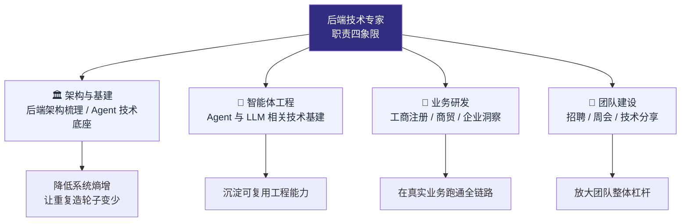

### 2.2 我对这个角色的理解

以 10 年+ 后端经验来看,一个"技术专家"在新团队的前三个月,价值排序应当是:

1. **先看清系统**——梳理现状、暴露隐性风险,而不是急着堆代码;
2. **补齐地基**——把靠"口口相传/个人经验"运转的环节,沉淀为团队可复用的资产;
3. **再谈业务与规模**——在稳固的地基上跑业务、带团队,让产出可持续、可复制。

这也正是我这三个月的实际路径,下文按此逻辑展开。

---

## 三、三个月工作全景

### 3.1 工作节奏与主线推进

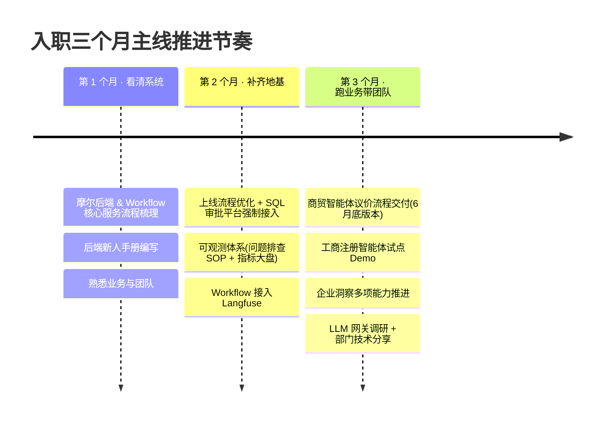

### 3.2 四大主线总览

| 主线 | 一句话结论 | 核心量化产出 |
|------|-----------|-------------|
| 📚 **流程与规范** | 梳理核心服务流程与上线规范,补齐后端"地基" | 摩尔后端 + Workflow 核心服务流程图;新人手册发布;上线流程优化 + **SQL 审批平台强制接入** |
| 🧱 **架构与基建** | 推进后端架构与 AI Agent 技术基建,为业务提供底座 | 后端架构 / Agent 基建方案分享;问题排查 SOP + 服务指标大盘;Workflow + Langfuse **100% 覆盖**;LLM 网关完成调研与测试 |
| 💼 **业务交付** | 主线业务迭代 + 智能体场景落地 | 工商注册试点可 Demo;**商贸智能体 6 月底版本核心议价流程对接**;企业洞察鉴权 / 看板 / 搜索优化 / 股权穿透 |
| 🤝 **团队 & 招聘** | 团队接口人 + 招聘持续供给 | 筛选简历 **70+**,面试 **12 人**,入职 **3 人**(在途 1);组织团队周会;**1 次部门分享** |

> 💡 **主线逻辑**:先补基建 → 再跑业务 → 最后带团队,目的是让后端能力从被动响应走向平台化供给。

---

## 四、成果详述

### 主线一:流程与规范建设(补齐后端"地基")

> **目标**:把"隐性知识"沉淀为团队可复用的资产,降低协作成本、提升上线安全性。

#### 项目 1 · 核心服务流程梳理

| 维度 | 内容 |
|------|------|
| **背景** | 后端服务长期"零散响应",新同学上手慢,问题排查靠个人经验 |
| **我的角色** | 主导梳理 |
| **关键行动** | 梳理 **摩尔后端服务** 与 **Workflow 核心服务** 的整体流程,产出可读性强的流程文档 |
| **成果价值** | 为新人 / 跨团队协作 / 问题排查提供统一参考基线,降低沟通与排查成本 |

**梳理后的核心服务调用主链路(示意):**

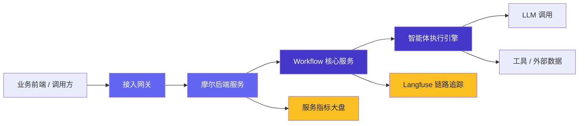

#### 项目 2 · 后端研发新人手册

| 维度 | 内容 |
|------|------|
| **背景** | 入职引导高度依赖口口相传,质量参差,新人上手周期长 |
| **我的角色** | 主导编写 |
| **关键行动** | 整理后端研发新人手册,**已发布后端群公告**,作为新人入职必读 |
| **成果价值** | 新人上手周期缩短;Review / 答疑成本下降;引导质量标准化 |

#### 项目 3 · 上线流程优化 · SQL 审批平台

| 维度 | 内容 |
|------|------|
| **背景** | 上线环节缺少强制卡点,SQL 类高风险变更存在失控风险 |
| **我的角色** | 主导推动落地 |
| **关键行动** | 优化上线流程,落地 **SQL 审批平台并强制接入**,把高风险变更纳入事前审批 |
| **成果价值** | 上线变更的事前可控性显著提升,降低线上事故概率 |

**上线流程优化前后对比:**

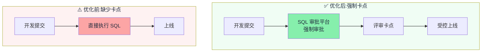

---

### 主线二:架构与 AI Agent 基建(打造平台底座)

> **目标**:为业务长期演进铺路,让"重复造轮子"和"被动救火"越来越少。

#### 项目 1 · 后端技术架构 + AI Agent 基建方案

| 维度 | 内容 |
|------|------|
| **背景** | 后端技术栈与 Agent 基建缺少统一规划,各业务线各自为战 |
| **我的角色** | 主导输出技术方案 |
| **关键行动** | 整理 **后端技术架构与 AI Agent 技术基建方案和规划**,团队分享并推进落地 |
| **成果价值** | 形成可对齐、可推进的技术蓝图,基建方向由"被动响应"转为"主动规划" |

**AI Agent 技术基建分层蓝图(规划视角):**

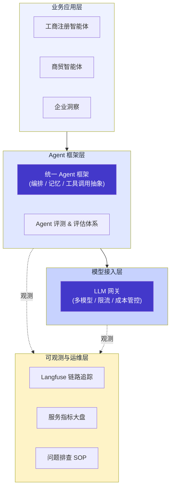

> 图中 **实线** 为当前已具备或推进中的能力,**虚线** 为可观测数据流;红框(下一阶段)聚焦「Agent 框架 + 评测 + LLM 网关」三块底座。

#### 项目 2 · 可观测体系:排查 SOP · 指标大盘 · Langfuse

| 维度 | 内容 |
|------|------|
| **背景** | Agent 工作流可观测性弱,问题排查依赖经验,服务健康度不直观 |
| **我的角色** | 主导设计 & 推进落地 |
| **关键行动** | 输出 **问题排查 SOP** + **服务指标大盘**;Workflow 接入 **Langfuse**,实现 **摩尔 100% 覆盖**;搭建 **智能体指标报表** |
| **成果价值** | Agent 调用链可视化;问题定位时间缩短;指标体系覆盖核心业务 |

**问题排查 SOP 决策流(将"靠经验"沉淀为"可复用流程"):**

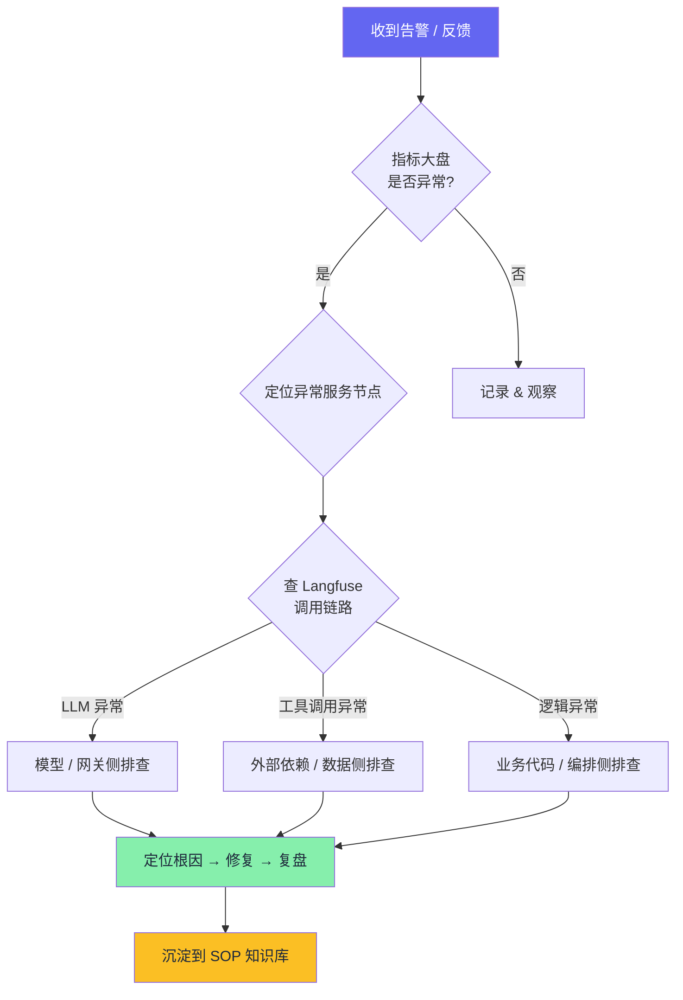

#### 项目 3 · LLM 网关 · 技术调研与测试

| 维度 | 内容 |
|------|------|
| **背景** | 业务多模型、多供应商调用混乱,缺少统一接入层,稳定性 / 成本 / 限流难管控 |
| **我的角色** | 主导调研 & 测试 |
| **关键行动** | 完成 LLM 网关技术调研 + 落地测试,为后续接入业务做准备 |
| **成果价值** | 输出可上线的网关方案,作为未来 Agent 平台的关键基础设施 |

**LLM 网关在架构中的定位(统一收口多模型调用):**

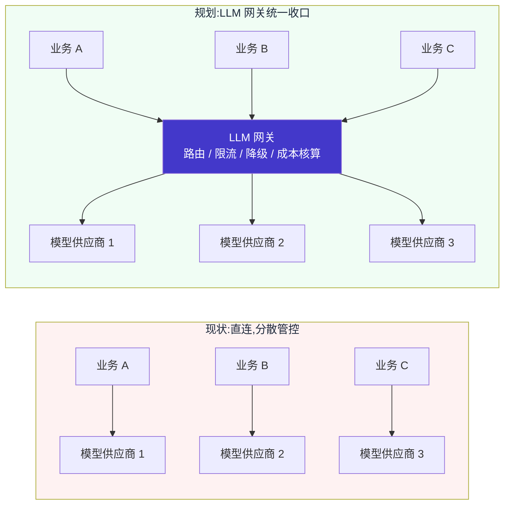

---

### 主线三:业务交付(智能体场景落地)

> **目标**:在真实业务里跑通 Agent 全链路,沉淀可复用的工程经验。

**三条业务线状态概览:**

| 业务线 | 我的角色 | 当前状态 | 备注 |
|--------|---------|:--------:|------|
| 工商注册智能体 | 方案设计 + 后端开发 | 🟡 试点可 Demo | 扩展性问题待收口 |
| 商贸智能体(6 月底版本) | 后端设计 + 议价流程对接 | 🟢 按期交付 | 带新人一起产出 |
| 企业洞察 | 主导推进 | 🟢 多项能力推进中 | 鉴权 / 看板 / 搜索 / 股权 |

#### 业务 1 · 工商注册智能体

| 维度 | 内容 |
|------|------|
| **背景** | 不同城市的工商注册站点存在差异,人工重复劳动高 |
| **我的角色** | 智能体方案设计 + 后端开发 |
| **关键行动** | 按城市进行流程拆解与实现,**试点城市流程可 Demo** |
| **现状与复盘** | ⚠️ **未能按期上线 & 全面铺开,整体效果不及预期**,主要受限于:① 算法协调　② 前端复杂性　③ 扩展性风险 |
| **下一步** | 收口扩展性问题,推动可控城市的稳定上线 |

**工商注册智能体流程与卡点分析:**

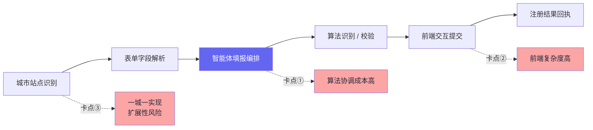

> **复盘要点**:**Demo 能跑 ≠ 能上线**。三个卡点任一被忽视都会拖住整体节奏,根因在于前期缺少充分的可行性 & 扩展性评估(详见[第五章](#五复盘与反思))。

#### 业务 2 · 商贸智能体(6 月底版本)

| 维度 | 内容 |
|------|------|
| **背景** | 商贸智能体需要打通"议价"核心链路,作为 6 月底版本的关键能力 |
| **我的角色** | 后端研发 & 设计,负责核心 Agent **议价流程对接** |
| **关键行动** | 设计并实现议价主链路;**指导一名新入职同学**完成"需求单历史功能"的开发与测试 |
| **成果价值** | 6 月底版本按期发布核心议价流程;新人快速上手并独立交付 |

**议价核心链路(简化):**

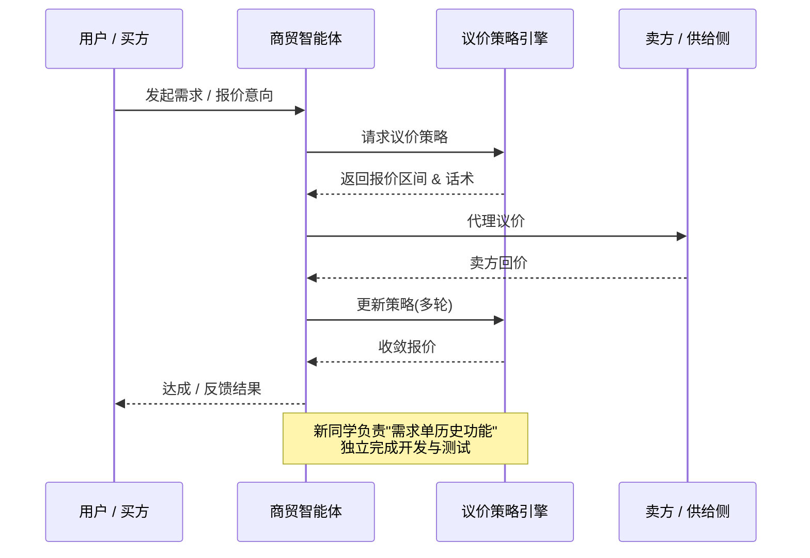

#### 业务 3 · 企业洞察

| 维度 | 内容 |
|------|------|
| **背景** | 数据接口无统一管控,搜索体验与股权类业务能力需要升级 |
| **我的角色** | 主导推进 |
| **关键行动** | ① **推动数据接口鉴权**　② **搭建调用量看板**　③ **搜索优化**　④ **股权穿透** 技术方案 |
| **成果价值** | 数据使用合规化 + 调用可观测;搜索与股权类能力具备落地路径 |

**企业洞察四项能力推进:**

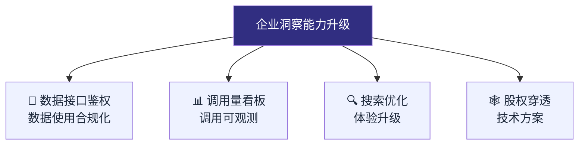

---

### 主线四:团队建设与招聘(从个人贡献到组织贡献)

> **目标**:从"个人贡献者"走向"组织贡献者",持续放大后端团队力量。

#### 1 · 后端接口人

- 跟进需求 & 问题,**协调人力**保障业务侧稳定交付;
- 作为后端对外的统一对接窗口,减少跨团队沟通摩擦。

#### 2 · 组织团队周会

- 周期性组织团队周会,促进**信息同步 + 互相交流 + 互通有无**,加强协作。

#### 3 · 招聘(用数字说话)

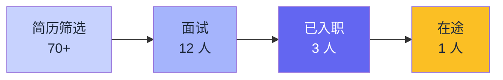

| 指标 | 数量 |
|------|:----:|
| 简历筛选 | **70+** |
| 面试 | **12 人** |
| 已入职 | **3 人** |
| 在途 | **1 人** |

#### 4 · 技术分享 & 方案讨论

- **多次**组织内部技术方案讨论(架构 / Agent / 业务);
- **1 次**部门级技术分享(后端架构 + AI Agent 基建方案)。

---

## 五、复盘与反思

### 5.1 做得好 · 还可以更好

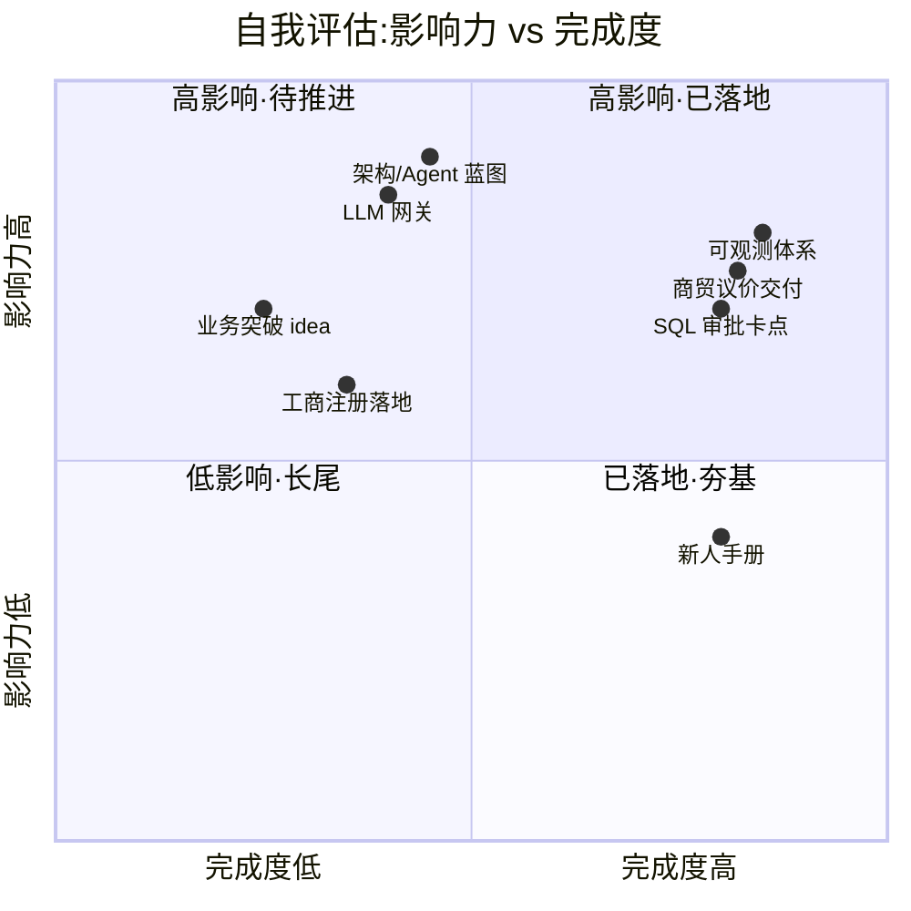

<table>
<tr>
<th width="50%">✅ 做得好</th>
<th width="50%">⚠️ 还可以更好</th>
</tr>
<tr>
<td valign="top">

- 🧭 **主动建基**:不止接需求,还主动梳理流程 / 编写新人手册 / 推进 SQL 审批平台
- 🧱 **架构先行**:输出后端架构与 AI Agent 基建蓝图,把分散工作收口为体系
- 📈 **可观测闭环**:Workflow + Langfuse 100% 覆盖 + 指标报表,排查有 SOP 可循
- 🚢 **业务能打**:商贸 6 月底版本议价流程按期交付,带新人一起产出
- 🤝 **团队融入**:周会 / 招聘 / 接口人 / 部门分享,横纵向同步都建立起来

</td>
<td valign="top">

- 💡 **业务 Sense 仍需加强**:对当前产品的突破方向,还没有特别多能"打破困境"的 idea,需更深入贴近用户与场景
- 🛠️ **平台性进度略慢**:精力更多投入具体技术细节,基建 & 平台性进展偏慢,整体偏被动
- 🧪 **智能体可复制性**:工商注册的扩展性需前置思考,避免"一城一套实现"的不可控蔓延

</td>
</tr>
</table>

### 5.2 方法论沉淀(比项目更长效的"软资产")

我把这三个月最重要的成长,提炼为三条可迁移的方法论:

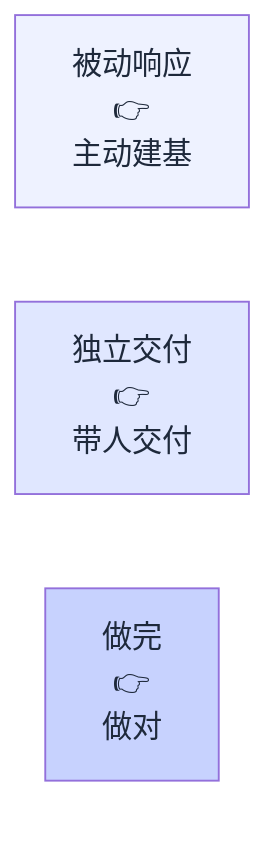

**① 从「被动响应」到「主动建基」**
入职初期工作容易被需求牵着走。三个月内我开始主动梳理流程、出新人手册、推 SQL 审批、铺可观测体系。我意识到:**基建投入的回报是指数级的**——下一个需求、第 N 个新人都能受益。后续会在 Agent 框架和 LLM 网关上持续投入。

**② 从「独立交付」到「带人交付」**
商贸智能体中,我承担"后端设计 + 指导新人"的双重角色。一个人的产出有上限,**把团队同学的杠杆用起来**才是技术专家真正的价值。新同学已能独立交付"需求单历史功能",验证了这条路径。

**③ 从「做完」到「做对」**
工商注册是一个反例:**Demo 能跑 ≠ 能上线**。站点差异 + 算法协作 + 前端复杂度 + 扩展风险,任一被忽视都会卡住整体节奏。后续我会更前置地做**可行性 & 扩展性评估**,而不是先埋头做再返工。

---

## 六、面向未来:下一阶段规划(3-6 个月)

### 6.1 规划优先级矩阵

| 优先级 | 方向 | 具体计划 | 预期价值 |
|:------:|------|---------|---------|
| **P0** | **业务版本稳定交付** | 高优保障业务版本迭代,做好补位 + 后端资源协调 | 业务交付确定性 ↑ |
| **P0** | **AI Agent 框架** | 推动 Agent 框架在多业务线落地,统一抽象 | 新 Agent 开发效率 ↑,能力可复用 |
| **P0** | **Agent 评测 & 评估** | 建立 Agent 评测 / 评估体系,量化业务效果 | 产品质量可衡量,迭代有依据 |
| **P0** | **LLM 网关** | 推进 LLM 网关上线,统一多模型接入 | 稳定性 ↑,成本可观测 |
| **P1** | **探索摩尔业务方向** | 与产品 / 算法一起探索业务突破方向,输出可验证 idea | 业务 Sense 补齐,产品突破 |
| **P1** | **基建提速** | 提升公共 / 平台性工作占比,从被动转主动 | 减少重复造轮子,提升平台化能力 |

### 6.2 未来能力演进路线图

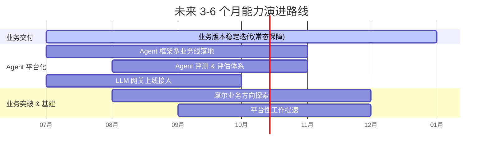

### 6.3 我的承诺

> 转正后,我将继续以 **业务交付确定性 × 平台基建能力 × 团队杠杆** 为驱动,
> 在 **AI Agent 工程化** 与 **业务突破方向探索** 上持续投入,
> 把后端能力从"被动响应"稳步推向"平台驱动"。

---

## 七、希望得到的反馈

> 主动邀请反馈,体现开放心态 + 自我驱动。

为帮助我持续成长,希望各位专家 / TL 能从以下维度给我反馈:

| 维度 | 我期待的反馈 |
|------|-------------|
| **技术深度** | 在后端架构 / Agent 工程化方向,我的方案是否足够扎实? |
| **业务推进** | 工商注册智能体不及预期的根因,我应如何前置避免? |
| **平台化视角** | 基建 & 平台性工作的优先级和切入点,有哪些更合适的姿势? |
| **团队贡献** | 作为后端接口人 / 招聘贡献者,我还有哪些可以做得更好的地方? |

**反馈收集方式:**

- 📩 **1on1**:`[希望与哪些专家 / TL 1on1,日期安排]`
- 📊 **问卷(可选)**:`[是否需要匿名问卷]`
- 💬 **IM 频道**:`[反馈群 / IM 频道]`

---

## 一句话总结

> 过去三个月,我用 **「3 条业务线 + 1 套可观测体系 + 1 套上线规范 + 1 份架构蓝图」**,证明了在 **后端架构 × 智能体工程化 × 团队协同** 上的能力;
>
> 接下来,我希望持续投入 **AI Agent 框架 / Agent 评测 / LLM 网关 / 业务方向探索**,与各团队一起把后端从"被动响应"推到"平台驱动"。
>
> **我已准备好,期待正式转正,继续与各位并肩作战。**

---

## 附录:关键数据与术语

### A. 关键数据速查

| 类别 | 指标 | 数值 |
|------|------|:----:|
| 业务 | 核心业务线交付 | 3 |
| 基建 | Workflow + Langfuse 覆盖率 | 100% |
| 基建 | 上线强制卡点 | SQL 审批平台 |
| 招聘 | 简历筛选 / 面试 | 70+ / 12 |
| 招聘 | 入职 / 在途 | 3 / 1 |
| 分享 | 部门级技术分享 | 1 |

### B. 术语表

| 术语 | 说明 |
|------|------|
| **Workflow** | 摩尔智能体工作流核心服务,承载 Agent 编排执行 |
| **Langfuse** | LLM 应用可观测平台,用于链路追踪与调用分析 |
| **LLM 网关** | 统一多模型 / 多供应商接入层,负责路由、限流、降级与成本核算 |
| **Agent 评测** | 对智能体输出质量进行量化评估的体系,支撑迭代决策 |
| **股权穿透** | 沿股权关系链层层解析实际控制人 / 关联关系的能力 |

---

<sub>📄 本文档为富文档报告(Markdown + Mermaid),可在 VS Code / Typora / GitHub 等支持 Mermaid 的环境中直接渲染查看。占位符 `[xxx]` 请替换为实际内容后再对外汇报。</sub>
